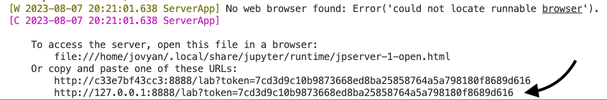

# Docker for python projects
This repository contains files and instructions for setting up a docker container for python projects. It includes files for building a docker image with a few common geospatial packages, along with jupyter lab + notebook. The environment is built inside the docker image using either a `conda-lock.yml` file or a conda `environment.yml`, and then pip dependencies are installed using a `requirements.txt` file. The repository also includes a handy-dandy Makefile for building the image and launching a JupyterLab instance from your local machine in the docker container. <br><br>
The repository author is grateful to the [Pangeo community](https://pangeo.io/) for its [open source repository](https://github.com/pangeo-data/pangeo-docker-images/tree/master) for building the pangeo docker images and extensive documentation on their construction. This repository is built off the pangeo docker workflow and recycles code from the Dockerfile for their [base image](https://github.com/pangeo-data/pangeo-docker-images/tree/master/base-image).

## What is docker?  
[Docker](https://www.docker.com/) enables developers to create isolated development environments that can be shared across platforms, avoiding the frustrating issue of passing around conda or pip environments that work on some machines but not others. Docker is a particularly useful tool for developers in the geospatial data space, since many geospatial python packages have complex dependencies that can be challenging to install. 

# The basics: using this repository 
This should all be relatively simply to set up, given that all the required files are included. Modifying the packages in the environment will require a little extra lifting. Otherwise, everything is done for you in the Makefile (see [this section](https://github.com/nicolejkeeney/geo-py-docker/blob/main/README.md#the-makefile) for more info). 

## (1) Setup 
The steps below will only need to be run once! 
1) Make sure that you have the docker app on your local machine, which can be downloaded from [docker.com](https://www.docker.com/). 
2) Clone this repository to your local machine:
```
git clone https://github.com/nicolejkeeney/geo-py-docker
```
4) [OPTIONAL] Customize the environment files to include packages of your preference. **Read the section on [docker images](https://github.com/nicolejkeeney/geo-py-docker/blob/main/README.md#the-docker-image) and [environment files](https://github.com/nicolejkeeney/geo-py-docker/blob/main/README.md#the-environment-files) for more information on this step.** 
5) Build the docker image:
```
make build
```
## (2) Launch JupyterLab from docker container 
Now that you have everything set up locally, you can run your python project in JupyterLab from within a docker container created by the image. Simply run the following command: 
```
make local
```
When you launch a JupyterLab instance from the docker container, the terminal output will print a link for you to open the JupyterLab in your browser. **You'll need to copy-paste this link into your web browser; it will not automatically open for you.** Use the **bottom** link. See the screenshot below.<br><br>

## (3) Run a python script 
I added an additional key to the Makefile that allows you to easily run a python script: 
```
make run
```
Simply modify the variable $PY_SCRIPT in the [Makefile](https://github.com/nicolejkeeney/geo-py-docker/blob/11d8ec97c1bd50b3acdb252c5e451872430e1831/Makefile#L38) to change the path to the script you want to run. 

# The nitty-gritty 
This section provides a more detailed explanation of the various components of the repository. Not required reading! 

## The docker image 
The image is built from a Dockerfile, which basically just provides the recipe for building the image that your machine then executes. It is built upon a minimal base image; in this case, our base image is ubuntu. The Dockerfile then provides instructions to create a conda environment from the base image by using either the `conda-lock.yml` or `environment.yml` file, then installs any pip dependencies from the `requirements.txt` file. It also sets up the required dependencies for running JupyterLab. 
## The environment files
conda-lock files are recommended over the conda `environment.yml` file for building the docker image. For more information on why this is recommended, refer to the documentation in the [conda-lock repo](https://github.com/conda/conda-lock) on GitHub.<br><br>***IMPORTANT: If you have both a conda-lock.yml and an environment.yml file in your directory, the Makefile will only look at the conda-lock.yml and ignore the environment.yml file***. The image can be built with just an `environment.yml` file, but you'll need to either remove the `conda-lock.yml` file from the directory (recommended) or modify the code in the Dockerfile (not recommended unless you're experienced with docker). <br><br>To create the lockfile, you'll first need an `environment.yml` file with all the conda dependencies listed. And, you'll need to `pip install conda-lock` (refer to the [conda-lock documentation](https://github.com/conda/conda-lock)) Then, you can simply create a multi-platform lockfile by running the command below: 
```
conda-lock -f environment.yml -p osx-64 -p linux-64
```

## The Makefile
The Makefile exists to make the lives of developers easier. It wraps up all the code required to build the image and launch JupyterLab from the container into a single file, allowing the developer to simply run `make build` to build the image and `make local` to launch JupyterLab. <br><br>How is it different from a shell script, you may ask? It doesn't run in parallel like a shell script. You can run isolated sections of code from the same Makefile. For example, `make build` runs just the command for building the image, which you'll only do once, whereas you'll use `make local` anytime you want to open a JupyterLab instance.<br><br>I added a few helpful commands to the Makefile: 
1) `make conda-lock`: make  the conda-lock file from the environment.yml file. **You need to have conda-lock installed first.**
2) `make build`: build the image.
3) `make local`: open JupyterLab from runtime instance of image.
4) `make run`: run a python script from runtime instance of image. Modify the path to the script in the Makefile [here](https://github.com/nicolejkeeney/geo-py-docker/blob/9bd12bbd5aacd94249ba44c0318eb0d546bada7f/Makefile#L38) to change the script.

# Troubleshooting 
If you are encountering errors when building the image, the terminal output will likely be a mysterious "[build] Error 1". You'll need to go into the log file build.log to inspect the actual error message to be able to troubleshoot because the actual terminal output is stored there. Below are some errors I've encountered while setting the image up on different machines, and how to troubleshoot them. <br><br>**If you encounter other errors not listed here and you find a solution, I would be grateful if you add them to the README here!** See the section on [contribution](https://github.com/nicolejkeeney/geo-py-docker/blob/main/README.md#find-an-issue-in-the-repo-or-want-to-contribute).
 for more info.
## You're out of space on your device
### The error message 
The error message might look something like this: 
```
ERROR:root:failed with error: [Errno 28] No space left on device:
```
### The solution 
Docker stores a lot of unneeded files, and these can build up if your building images and running containers a lot. You can remove all containers/images with the following code (**PROCEED WITH CAUTION!**):
```
docker system prune --all 
```
Or: 
```
docker system prune --all --force --volumes
```
I'm not very familiar with what these commands do and haven't had the time to do my due diligence and check yet. I want to emphasize that you should be careful using either of these commands.  
## Are you on a fancy new Mac? 
A collaborator running this code was having an issue building the image from the Dockerfile. We developed a simple workaround. Her computer was a M2 Pro chip on macOS Ventura, I anticipate that this issue might also occur on the M1 Max MacBook Pro as well and other similar systems.
### The error message
The issue she ran into occurred during the installation of Mambaforge. The output from the build log file is: 
```
qemu-x86_64: Could not open '/lib64/ld-linux-x86-64.so.2': No such file or directory
```
### The solution 
Following a [thread from StackOverflow](https://stackoverflow.com/questions/71040681/qemu-x86-64-could-not-open-lib64-ld-linux-x86-64-so-2-no-such-file-or-direc), the solution is to simply modify the first (non-comment) line in the Dockerfile (in which the base image is set) to **specify the platform** used. The line should be: 
```
FROM --platform=linux/amd64 ubuntu:22.04
```
## You don't have write permissions to a conda path 
I'm honestly not sure what causes this issue, but I assume it has something to do with a bad setting somehow being set unintentionally (??). Any insights here are welcome.
### The error message
Building the Docker image fails at the step when the conda environment is build. The output from the build log is: 
```
ERROR:root:The current user does not have write permissions to a required path.
ERROR:root:  path: /srv/conda/pkgs/urls.txt
```
### The solution 
This isn't a very satisfying solution, but more of a "turn it off and then on again" hacky fix. After pushing all the local files that I wanted to keep to the GitHub repo, I deleted my local version of the repo and re-cloned it, starting fresh. The Docker image then was able to be build. Presumably starting from a clean slate allowed whatever setting or cache had been causing the issue to be reset.
## Find an issue in the repo, or want to contribute? 
Please reach out if you find any issues in the code or descriptive text. You can use any of the following messages to contribute: 
1) Open an [issue](https://github.com/nicolejkeeney/geo-py-docker/issues)
2) Start a new [discussion](https://github.com/nicolejkeeney/geo-py-docker/discussions)
3) Fix the issue in a new branch and [open a pull request](https://github.com/nicolejkeeney/geo-py-docker/pulls) for me to review
